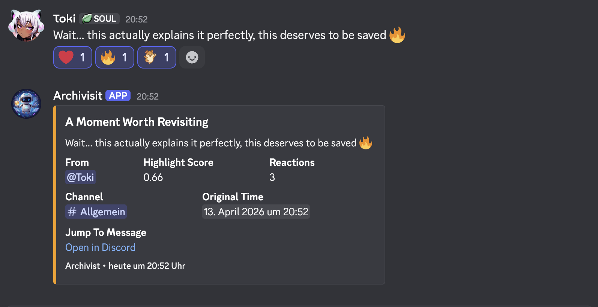

# ✨ Archivist

**A privacy-first Discord bot for the moments your community should not lose.**

_Not a full chat archive. A memory layer for your community._

🇬🇧 [English](#-english) | 🇩🇪 [Deutsch](#-deutsch) | 🇪🇸 [Español](#-español)

---

# 🇬🇧 English

## Archivist

Archivist helps Discord communities hold on to the messages that actually matter.  
It turns standout conversations into highlights, daily featured moments, and weekly recaps without trying to store everything.

This is not a utility bot trying to do a little bit of everything. Archivist is focused on one job: helping communities remember what was worth keeping.

## Visual Preview



Moment of the Day and Weekly Recap previews are coming soon.

## Features

- **Smart highlight detection**  
  Scores messages using reactions, sentiment, keywords, and surrounding context.

- **Promote / demote behavior**  
  Keeps highlights honest when reactions change or a message is edited later.

- **Polished highlight embeds**  
  Shares memorable messages with content, author, channel, score, reactions, and a jump link.

- **Moment of the Day**  
  Brings back one standout saved message as a daily featured moment.

- **Weekly Recap**  
  Collects the strongest saved moments into a compact weekly look back.

- **`/analyze` preview**  
  Lets you preview scoring without storing anything.

- **Admin controls inside Discord**  
  Manage recurring posts, thresholds, channels, and health without leaving Discord.

- **Consent-based privacy**  
  Keeps privacy visible and user-controlled from the start.

- **SQLite persistence**  
  Lightweight local storage for highlights, settings, and privacy state.

## How it works

### 1. Detect

Archivist watches for messages that feel meaningful, not just noisy.

### 2. Save

When a message crosses the threshold, Archivist stores a privacy-safe highlight record.

### 3. Surface

That saved moment can appear as a highlight, a daily Moment of the Day, or part of a Weekly Recap.

To preserve Discord channel access boundaries, saved excerpts are surfaced only in the channel they came from. Legacy rows without a provable source channel stay excluded from recaps and daily moments.

Under the hood, Archivist combines reactions, sentiment, keywords, and message context to score messages. If a message gets stronger later, it can be promoted. If it loses signal, it can be demoted again.

Reaction scoring counts each human, non-author voter only once across all emoji, including super reactions. If Discord cannot provide a current voter list, that unavailable reaction data does not affect the score.

## Privacy-first

Archivist is built around a simple idea: keep what matters, avoid storing what does not.

- no full chat history
- no raw archive of everything
- consent-based processing
- short, automatically redacted highlight excerpts
- user-facing privacy controls

Automatic redaction removes common structured identifiers, but it cannot reliably
remove every free-form name, address, or identifying detail. Stored excerpts should
therefore be treated as pseudonymous community data, not guaranteed anonymous data.

Users can manage privacy with:

- `/privacy consent`
- `/privacy status`
- `/privacy delete`

## Example flow

1. A message gets strong reactions and scores well
2. Archivist saves it as a highlight
3. It can be auto-posted as a highlight embed in its original channel
4. It may later become the **Moment of the Day**
5. It can also appear in the **Weekly Recap**

## Commands overview

Core commands:

```text
/help
/analyze
/privacy consent
/privacy status
/privacy delete
/archivist overview
/archivist leaderboard
/archivist points
/archivist threshold
/archivist autopost
/archivist channel
/archivist privacy
/archivist health
/archivist inspect
/archivist weekly
/archivist motd
/archivist backup
/archivist clear
/weekly
```

## Setup

### Requirements

- Node.js 22.13+
- A Discord application with a bot user
- The privileged **Message Content Intent** enabled in the Discord Developer Portal
- Bot permissions to view channels, read message history, send messages, embed links,
  and use application commands

### Environment

Create a `.env` file:

```env
DISCORD_TOKEN=your_bot_token_here
ALLOWED_GUILD_ID=your_server_id_here
```

Optional values can also be added for scoring, status, and scheduling behavior.

For a new database, omit or comment out `PRIVACY_SALT` to let Archivist generate a
private 32-byte salt in `.privacy_salt` next to the database. Later starts reuse that
file and refuse to create a replacement if the database already exists. Do not leave
an active assignment empty. For a managed secret, use exactly
`PRIVACY_SALT=<64 hexadecimal characters>` with no quotes, spaces, comments, or
duplicate assignments (generate it with `openssl rand -hex 32`). Back up the salt
securely together with the database and never rotate, delete, trim, or reformat it
for an existing archive: changing it makes existing consent, deletion, points, and
highlight lookups unreachable. Older nonconforming configured salts now fail at
startup instead of being changed silently; replacing one requires a deliberate new
database because the original Discord IDs are intentionally not stored.

Archivist intentionally runs in single-server mode. The SQLite database is bound to
`ALLOWED_GUILD_ID`, interactions and events from other servers are rejected, and
outgoing posts are checked against the same server. If you are upgrading an existing
non-empty database, set `LEGACY_GUILD_ID` to the same server ID for its first start,
then remove that one-time setting.

On POSIX systems, Archivist creates or corrects the SQLite database, WAL, and SHM
files to owner-only mode (`0600`). A dedicated data directory with mode `0700` and a
deployment umask of `0077` are still recommended. Archivist does not change the parent
directory because `DATABASE_PATH` may point into an operator-managed location. On
Windows, restrict the data directory with the service account's filesystem ACLs;
POSIX mode bits do not provide equivalent access control there.

### Install

```bash
npm install
```

### Run

```bash
node index.js
```

After the bot is online, start with:

```text
/archivist overview
```

## Architecture overview

Main files:

- `index.js`  
  Startup, client setup, command loading, slash registration, and interaction routing

- `archivist.js`  
  Scoring, persistence, privacy logic, reports, and settings

- `runtime.js`  
  Event handling, per-message queueing, scheduling, and posting logic

- `commands/`  
  Slash commands and in-Discord admin actions

- `embed-style.js`  
  Shared embed styling

- `archivist.test.js`  
  Tests for scoring, runtime behavior, Moment of the Day, Weekly Recap, and cleanup

## Roadmap

- richer recap presentation
- better first-run onboarding
- broader interaction test coverage
- stronger visibility for recurring post status
- optional export and review tools for community memory

## License

MIT. See [`LICENSE`](./LICENSE).

---

# 🇩🇪 Deutsch

## Archivist

Archivist hilft Discord-Communities dabei, die Nachrichten zu behalten, die wirklich etwas bedeutet haben.  
Der Bot macht aus starken Gesprächen Highlights, tägliche Lieblingsmomente und wöchentliche Rückblicke, ohne den ganzen Chatverlauf speichern zu wollen.

Archivist will nicht alles gleichzeitig sein. Der Fokus ist klar: bedeutende Nachrichten erkennen, datenschutzfreundlich bewahren und später wieder sichtbar machen.

## Visual Preview


Vorschauen für Moment of the Day und Weekly Recap folgen noch.

## Features

- **Intelligente Highlight-Erkennung**  
  Bewertet Nachrichten anhand von Reaktionen, Sentiment, Keywords und Kontext.

- **Promote- / Demote-Logik**  
  Hält Highlights glaubwürdig, wenn sich Reaktionen ändern oder eine Nachricht später bearbeitet wird.

- **Saubere Highlight-Embeds**  
  Zeigt erinnerungswürdige Nachrichten mit Inhalt, Autor, Kanal, Score, Reaktionen und Jump-Link.

- **Moment of the Day**  
  Holt jeden Tag einen gespeicherten starken Moment noch einmal nach vorn.

- **Weekly Recap**  
  Bündelt die besten gespeicherten Momente der Woche in einem kompakten Rückblick.

- **`/analyze` Vorschau**  
  Zeigt das Scoring, ohne etwas zu speichern.

- **Admin-Steuerung direkt in Discord**  
  Wiederkehrende Posts, Thresholds, Kanäle und Health lassen sich direkt im Server steuern.

- **Zustimmungsbasierter Datenschutz**  
  Datenschutz ist sichtbar, verständlich und von Nutzern kontrollierbar.

- **SQLite-Persistenz**  
  Leichter lokaler Speicher für Highlights, Einstellungen und Datenschutzstatus.

## Wie es funktioniert

### 1. Erkennen

Archivist beobachtet Nachrichten, die bedeutungsvoll wirken, nicht einfach nur laut.

### 2. Speichern

Wenn eine Nachricht den Schwellwert überschreitet, speichert Archivist einen datenschutzfreundlichen Highlight-Eintrag.

### 3. Wieder sichtbar machen

Dieser gespeicherte Moment kann als Highlight, als täglicher Moment of the Day oder im Weekly Recap wieder auftauchen.

Damit Discord-Kanalrechte erhalten bleiben, werden gespeicherte Auszüge nur in ihrem Ursprungskanal wieder angezeigt. Alte Einträge ohne nachweisbaren Ursprungskanal bleiben aus Recaps und täglichen Momenten ausgeschlossen.

Im Hintergrund kombiniert Archivist Reaktionen, Sentiment, Keywords und Nachrichtenkontext. Wird eine Nachricht später stärker, kann sie hochgestuft werden. Verliert sie an Signal, kann sie auch wieder heruntergestuft werden.

Beim Reaktions-Score zählt jeder menschliche Nutzer außer dem Nachrichtenautor nur einmal über alle Emojis hinweg, einschließlich Super-Reactions. Kann Discord keine aktuelle Nutzerliste liefern, beeinflussen diese nicht verfügbaren Reaktionsdaten den Score nicht.

## Privacy-first

Archivist folgt einer einfachen Regel: Das Relevante behalten, den Rest nicht unnötig speichern.

- kein vollständiger Chatverlauf
- kein rohes Komplettarchiv
- zustimmungsbasierte Verarbeitung
- kurze, automatisch redigierte Highlight-Auszüge
- sichtbare Datenschutz-Steuerung

Die automatische Redaction entfernt typische strukturierte Kennungen, kann aber
freie Namen, Adressen oder andere identifizierende Details nicht zuverlässig
vollständig erkennen. Gespeicherte Auszüge sind deshalb pseudonymisierte
Community-Daten und keine garantiert anonymen Daten.

Nutzer verwalten das über:

- `/privacy consent`
- `/privacy status`
- `/privacy delete`

## Beispielablauf

1. Eine Nachricht bekommt starke Reaktionen und einen guten Score
2. Archivist speichert sie als Highlight
3. Sie kann automatisch in ihrem Ursprungskanal als Highlight-Embed gepostet werden
4. Später kann sie zum **Moment of the Day** werden
5. Sie kann auch im **Weekly Recap** erscheinen

## Command-Überblick

Wichtige Commands:

```text
/help
/analyze
/privacy consent
/privacy status
/privacy delete
/archivist overview
/archivist leaderboard
/archivist points
/archivist threshold
/archivist autopost
/archivist channel
/archivist privacy
/archivist health
/archivist inspect
/archivist weekly
/archivist motd
/archivist backup
/archivist clear
/weekly
```

## Setup

### Voraussetzungen

- Node.js 22.13+
- Eine Discord-Anwendung mit Bot-User
- Den privilegierten **Message Content Intent** im Discord Developer Portal
- Bot-Berechtigungen zum Anzeigen von Kanälen, Lesen des Nachrichtenverlaufs,
  Senden von Nachrichten, Einbetten von Links und Verwenden von Application Commands

### Umgebung

Erstelle eine `.env` Datei:

```env
DISCORD_TOKEN=your_bot_token_here
ALLOWED_GUILD_ID=your_server_id_here
```

Optional können weitere Werte für Scoring, Status und Zeitsteuerung ergänzt werden.

Lasse `PRIVACY_SALT` bei einer neuen Datenbank ganz weg oder auskommentiert, damit
Archivist daneben automatisch einen privaten 32-Byte-Salt in `.privacy_salt`
erzeugt. Spätere Starts verwenden diese Datei erneut und erzeugen keinen Ersatz,
falls die Datenbank bereits existiert. Eine aktive Zuweisung darf nicht leer bleiben.
Ein selbst verwalteter Wert muss exakt als `PRIVACY_SALT=<64 Hexzeichen>` ohne
Anführungszeichen, Leerzeichen, Kommentare oder doppelte Zuweisung eingetragen
werden (erzeugt zum Beispiel mit `openssl rand -hex 32`). Sichere den Salt zusammen
mit der Datenbank und ändere, lösche, kürze oder formatiere ihn bei einem bestehenden
Archiv niemals neu: Sonst sind vorhandene Einwilligungen, Löschungen, Punkte und
Highlight-Zuordnungen nicht mehr erreichbar. Ältere Werte in einem anderen Format
führen nun bewusst zu einem Startfehler; ihr Austausch setzt eine absichtliche neue
Datenbank voraus, da die ursprünglichen Discord-IDs nicht gespeichert werden.

Archivist läuft absichtlich im Einzelserver-Modus. Die SQLite-Datenbank wird fest an
`ALLOWED_GUILD_ID` gebunden; Ereignisse, Interaktionen und Zielkanäle anderer Server
werden abgewiesen. Bei einer bestehenden, nicht leeren älteren Datenbank muss beim
ersten Start einmalig `LEGACY_GUILD_ID` auf dieselbe Server-ID gesetzt und danach
wieder entfernt werden.

### Installation

```bash
npm install
```

### Start

```bash
node index.js
```

Wenn der Bot online ist, starte mit:

```text
/archivist overview
```

## Architekturüberblick

Wichtige Dateien:

- `index.js`  
  Start, Client-Setup, Command-Laden, Slash-Registrierung und Interaction-Routing

- `archivist.js`  
  Scoring, Persistenz, Datenschutzlogik, Reports und Einstellungen

- `runtime.js`  
  Event-Verarbeitung, Queue pro Nachricht, Scheduling und Posting-Logik

- `commands/`  
  Slash-Commands und Admin-Aktionen in Discord

- `embed-style.js`  
  Gemeinsamer Embed-Stil

- `archivist.test.js`  
  Tests für Scoring, Runtime-Verhalten, Moment of the Day, Weekly Recap und Cleanup

## Roadmap

- stärkere Darstellung für Recaps
- besseres Onboarding für neue Server
- breitere Tests für Interaktionsflüsse
- mehr Sichtbarkeit für wiederkehrende Posts
- optionale Export- und Review-Tools für Community-Memory

## Lizenz

MIT. Siehe [`LICENSE`](./LICENSE).

---

# 🇪🇸 Español

## Archivist

Archivist ayuda a las comunidades de Discord a conservar los mensajes que realmente dejaron huella.  
Convierte buenas conversaciones en highlights, momentos diarios destacados y resúmenes semanales, sin querer guardar todo el historial del chat.

Archivist no intenta hacer de todo un poco. Su idea es clara: detectar mensajes importantes, guardarlos con cuidado y volver a mostrarlos cuando tenga sentido.

## Visual Preview


Próximamente se añadirán vistas previas de Moment of the Day y Weekly Recap.

## Features

- **Detección inteligente de highlights**  
  Puntúa mensajes usando reacciones, sentimiento, palabras clave y contexto.

- **Lógica de promote / demote**  
  Mantiene los highlights honestos cuando cambian las reacciones o se edita un mensaje.

- **Embeds de highlights bien presentados**  
  Muestra mensajes memorables con contenido, autor, canal, puntuación, reacciones y enlace directo.

- **Moment of the Day**  
  Recupera cada día un momento guardado que merece volver a verse.

- **Weekly Recap**  
  Reúne los mejores momentos guardados de la semana en un resumen compacto.

- **Vista previa con `/analyze`**  
  Permite revisar la puntuación sin guardar nada.

- **Controles de admin dentro de Discord**  
  Publicaciones recurrentes, thresholds, canales y salud del sistema se gestionan desde Discord.

- **Privacidad basada en consentimiento**  
  La privacidad es visible, clara y controlada por los usuarios.

- **Persistencia con SQLite**  
  Almacenamiento local y ligero para highlights, ajustes y estado de privacidad.

## Cómo funciona

### 1. Detectar

Archivist observa mensajes que parecen importantes, no solo ruidosos.

### 2. Guardar

Cuando un mensaje supera el umbral, Archivist guarda un registro de highlight con enfoque de privacidad.

### 3. Volver a mostrar

Ese momento guardado puede aparecer como highlight, como Moment of the Day o dentro del Weekly Recap.

Para respetar los permisos de cada canal de Discord, los extractos guardados solo vuelven a mostrarse en su canal de origen. Los registros antiguos sin un canal de origen demostrable quedan fuera de los resúmenes y momentos diarios.

Por dentro, Archivist combina reacciones, sentimiento, palabras clave y contexto del mensaje. Si un mensaje gana fuerza más tarde, puede subir. Si pierde señal, también puede bajar.

La puntuación de reacciones cuenta una sola vez a cada persona que no sea el autor, aunque use varios emojis, e incluye las superreacciones. Si Discord no puede proporcionar una lista actual de usuarios, esos datos no disponibles no afectan a la puntuación.

## Privacy-first

Archivist sigue una idea simple: guardar lo importante sin almacenar de más.

- no guarda todo el historial del chat
- no crea un archivo bruto completo
- usa procesamiento basado en consentimiento
- guarda extractos breves con redacción automática
- ofrece controles de privacidad visibles

La redacción automática elimina identificadores estructurados habituales, pero no
puede reconocer de forma fiable todos los nombres, direcciones u otros detalles de
texto libre. Los extractos deben tratarse como datos seudónimos, no como datos con
anonimato garantizado.

Los usuarios pueden gestionarlo con:

- `/privacy consent`
- `/privacy status`
- `/privacy delete`

## Flujo de ejemplo

1. Un mensaje recibe buenas reacciones y una puntuación alta
2. Archivist lo guarda como highlight
3. Puede publicarse automáticamente como embed de highlight en su canal de origen
4. Más tarde puede convertirse en **Moment of the Day**
5. También puede aparecer en el **Weekly Recap**

## Resumen de comandos

Comandos principales:

```text
/help
/analyze
/privacy consent
/privacy status
/privacy delete
/archivist overview
/archivist leaderboard
/archivist points
/archivist threshold
/archivist autopost
/archivist channel
/archivist privacy
/archivist health
/archivist inspect
/archivist weekly
/archivist motd
/archivist backup
/archivist clear
/weekly
```

## Setup

### Requisitos

- Node.js 22.13+
- Una aplicación de Discord con usuario bot
- El **Message Content Intent** privilegiado activado en Discord Developer Portal
- Permisos para ver canales, leer el historial, enviar mensajes, insertar enlaces y
  usar comandos de aplicación

### Entorno

Crea un archivo `.env`:

```env
DISCORD_TOKEN=your_bot_token_here
ALLOWED_GUILD_ID=your_server_id_here
```

También puedes añadir valores opcionales para puntuación, estado y programación.

Para una base de datos nueva, omite o deja comentado `PRIVACY_SALT` para que
Archivist genere automáticamente un salt privado de 32 bytes en `.privacy_salt`,
junto a la base de datos. Los siguientes arranques reutilizan ese archivo y no crean
un sustituto si la base ya existe. No dejes una asignación activa vacía. Para
gestionar el secreto externamente, usa exactamente
`PRIVACY_SALT=<64 caracteres hexadecimales>` sin comillas, espacios, comentarios ni
asignaciones duplicadas (genéralo, por ejemplo, con `openssl rand -hex 32`). Guarda
una copia segura del salt junto con la base de datos y no lo cambies, elimines,
recortes ni reformatees para un archivo existente: si cambia, dejan de ser accesibles
los consentimientos, borrados, puntos y highlights anteriores. Los valores antiguos
con otro formato ahora detienen el arranque en vez de modificarse silenciosamente;
sustituir uno requiere crear deliberadamente una base de datos nueva porque los ID
originales de Discord no se almacenan.

Archivist funciona intencionadamente con un solo servidor. La base SQLite queda
vinculada a `ALLOWED_GUILD_ID`; se rechazan eventos, interacciones y canales de
destino de otros servidores. Para una base antigua no vacía, define una sola vez
`LEGACY_GUILD_ID` con el mismo ID durante el primer inicio y elimínalo después.

### Instalación

```bash
npm install
```

### Ejecutar

```bash
node index.js
```

Cuando el bot esté en línea, empieza con:

```text
/archivist overview
```

## Visión general de la arquitectura

Archivos principales:

- `index.js`  
  Arranque, configuración del cliente, carga de comandos, registro de slash commands y routing de interacciones

- `archivist.js`  
  Puntuación, persistencia, lógica de privacidad, reportes y ajustes

- `runtime.js`  
  Manejo de eventos, cola por mensaje, scheduling y lógica de publicación

- `commands/`  
  Slash commands y acciones de admin dentro de Discord

- `embed-style.js`  
  Estilo compartido para embeds

- `archivist.test.js`  
  Pruebas para puntuación, runtime, Moment of the Day, Weekly Recap y limpieza

## Roadmap

- presentación más fuerte para los recaps
- mejor onboarding para servidores nuevos
- más pruebas para flujos de interacción
- mejor visibilidad del estado de publicaciones recurrentes
- herramientas opcionales de exportación y revisión para memoria de comunidad

## Licencia

MIT. Consulta [`LICENSE`](./LICENSE).
